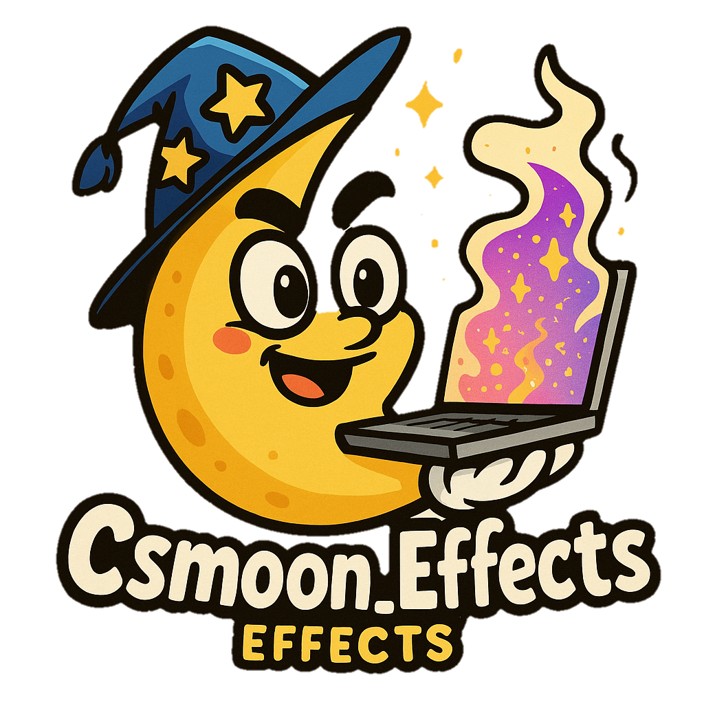

# Csmoon_Effects Library



[](https://github.com/isamytanaka/Csmoon_Effects)


[](https://github.com/isamytanaka/Csmoon_Effects/releases)


[](https://github.com/isamytanaka/Csmoon_Effects/blob/main/LICENSE)


## About Csmoon_Effects

Csmoon_Effects is a powerful transpiler library that bridges the gap between Lua scripting and C# visual effects, allowing developers to create stunning 2D visual effects with precise control. By writing simple Lua code that gets transpiled to optimized C#, you can build complex particle systems, lighting effects, and animations without requiring deep graphics programming knowledge or external tools.

## Key Features

- **Lua-to-C# Transpiler**: Write simple Lua code and generate optimized C# visual effects
- **Zero External Dependencies**: Self-contained library with no additional requirements
- **Optimized Performance**: Generated code is optimized for runtime efficiency
- **Visual Effect Templates**: Ready-to-use effect templates for common scenarios
- **Cross-Platform Compatibility**: Works on all platforms that support Lua and C#
- **Comprehensive Effect Suite**: Create particles, lights, filters, animations, and transitions
- **Composable Effects**: Combine multiple effects with various blending modes

## Installation

Getting started with Csmoon_Effects is simple:

1. Download the `Csmoon_Effects.lua` file from the releases page
2. Place it in your project directory
3. Import the library using `require("Csmoon_Effects")`

```lua
local Effects = require("Csmoon_Effects")
```

## Basic Usage

```lua
-- Create a particle effect
local particles = Effects.createParticles({
    name = "MyParticles",
    maxParticles = 100,
    emissionRate = 10,
    lifetime = 2,
    startSize = 1,
    endSize = 0.1,
    startColor = {r=1,g=1,b=1,a=1},
    endColor = {r=1,g=1,b=1,a=0},
    texture = "path/to/texture",
    -- additional settings...
})

-- Generate C# code
local csharpCode = Effects.generateCode()

-- Save to a file
Effects.saveToFile("GeneratedEffects.cs")
```

## Main API

### Particle System

Create dynamic particle systems with precise control over emission, lifetime, color, size, and movement.

```lua
Effects.createParticles({
    name = "ParticleName",          -- Name of the effect (string)
    maxParticles = 100,             -- Maximum number of particles (number)
    emissionRate = 10,              -- Emission rate (particles/second) (number)
    lifetime = 2,                   -- Particle lifetime (seconds) (number)
    startSize = 1,                  -- Starting size (number)
    endSize = 0.1,                  -- Ending size (number)
    startColor = {r=1,g=1,b=1,a=1}, -- Starting color (table with r,g,b,a)
    endColor = {r=1,g=1,b=1,a=0},   -- Ending color (table with r,g,b,a)
    texture = "path/to/texture",    -- Texture path (string)
    gravity = {x=0, y=-9.8},        -- Gravity vector (table with x,y)
    position = {x=0, y=0},          -- Emitter position (table with x,y)
    velocity = {x=0, y=1},          -- Base velocity (table with x,y)
    velocityVariation = 0.5         -- Random velocity variation (number)
})
```

### Light Effects

Create dynamic light sources with control over type, color, intensity, and shadows.

```lua
Effects.createLight({
    type = "Point",               -- Light type: "Point", "Directional", "Spot" (string)
    color = {r=1, g=1, b=1},      -- Light color (table with r,g,b)
    intensity = 1,                -- Light intensity (number)
    range = 5,                    -- Light range (number)
    position = {x=0, y=0},        -- Light position (table with x,y)
    falloff = 1,                  -- Falloff rate (number)
    castShadows = true            -- If it casts shadows (boolean)
})
```

### Filters

Apply visual filters to create effects like blur, glow, and color adjustments.

```lua
Effects.createFilter({
    type = "Blur",                -- Filter type: "Blur", "Glow", "ColorAdjust", etc. (string)
    strength = 1,                 -- Filter strength (number)
    color = {r=1, g=1, b=1},      -- Color influence (table with r,g,b)
    radius = 5,                   -- Effect radius (number)
    center = {x=0.5, y=0.5},      -- Effect center (normalized 0-1) (table with x,y)
    parameters = {}               -- Specific filter parameters (table)
})
```

### Animations

Create time-based animations with keyframes and easing functions.

```lua
Effects.createAnimation({
    duration = 1,                 -- Animation duration in seconds (number)
    loop = true,                  -- If animation should repeat (boolean)
    target = "Position",          -- Target property: "Position", "Scale", "Rotation", etc. (string)
    keyframes = {                 -- List of keyframes (table of tables)
        {time = 0, value = 0, easing = "Linear"},
        {time = 0.5, value = 1, easing = "QuadOut"},
        {time = 1, value = 0, easing = "QuadIn"}
    }
})
```

### Transitions

Create smooth transitions between two states with various easing functions.

```lua
Effects.createTransition({
    duration = 1,                 -- Transition duration in seconds (number)
    type = "Fade",                -- Transition type: "Fade", "Scale", "Move", etc. (string)
    easing = "Linear",            -- Easing function (string)
    from = 0,                     -- Starting value (number or table)
    to = 1,                       -- Ending value (number or table)
    target = "Alpha"              -- Target property (string)
})
```

### Effect Composition

Combine multiple effects into a single composite effect with blending modes.

```lua
Effects.composeEffects({
    name = "CompositeEffect",     -- Name of composite effect (string)
    effects = {effect1, effect2}, -- List of effects to combine (table)
    blendMode = "Normal"          -- Blend mode: "Normal", "Add", "Multiply", etc. (string)
})
```

## Pre-made Effect Templates

Save time with ready-to-use effect templates for common scenarios:

```lua
-- Explosion effect at position (x,y) with optional scale
local explosion = Effects.templates.explosionParticles(x, y, scale)

-- Pulsing light at position (x,y) with optional color and frequency
local pulsatingLight = Effects.templates.pulsingLight(x, y, color, frequency)

-- Fairy dust trail effect
local fairyDust = Effects.templates.fairyDustTrail(x, y, color)

-- Electric arc effect between two points
local electricArc = Effects.templates.electricArc(startX, startY, endX, endY)

-- Smoke effect with customizable density
local smoke = Effects.templates.smokeEffect(x, y, density)

-- Water splash effect
local splash = Effects.templates.waterSplash(x, y, force)
```

## Transpilation Functions

Generate C# code from your Lua effect definitions:

```lua
-- Generate C# code for all defined effects
local code = Effects.generateCode()

-- Generate C# code with additional optimization level (1-3)
local optimizedCode = Effects.generateCode(3)

-- Save generated code to a file
local success, error = Effects.saveToFile("filename.cs")

-- Generate and save code with namespace
local success, error = Effects.saveToFile("filename.cs", "MyGame.Effects")
```

## Available Easing Functions

Create natural-looking animations with these easing functions:

* Linear
* QuadIn, QuadOut, QuadInOut
* CubicIn, CubicOut, CubicInOut
* QuartIn, QuartOut, QuartInOut
* QuintIn, QuintOut, QuintInOut
* SineIn, SineOut, SineInOut
* ExpoIn, ExpoOut, ExpoInOut
* CircIn, CircOut, CircInOut
* ElasticIn, ElasticOut, ElasticInOut
* BackIn, BackOut, BackInOut
* BounceIn, BounceOut, BounceInOut

## Advanced Examples

### Fire Effect

Create a realistic fire effect with particles and dynamic lighting:

```lua
local fire = Effects.createParticles({
  name = "Fire",
  maxParticles = 200,
  emissionRate = 30,
  lifetime = 2,
  startSize = 1.2,
  endSize = 0.2,
  startColor = {r=1, g=0.7, b=0.2, a=1},
  endColor = {r=1, g=0.3, b=0.1, a=0},
  texture = "fire_particle",
  gravity = {x=0, y=-2},
  position = {x=0, y=0},
  velocity = {x=0, y=3},
  velocityVariation = 1.5
})

local fireLight = Effects.createLight({
  type = "Point",
  color = {r=1, g=0.6, b=0.2},
  intensity = 1.5,
  range = 8,
  position = {x=0, y=1}
})

local campfireEffect = Effects.composeEffects({
  name = "Campfire",
  effects = {fire, fireLight},
  blendMode = "Screen"
})
```

### Water Wave

Create a dynamic water surface with displacement and color effects:

```lua
local waterWave = Effects.createAnimation({
  duration = 2,
  loop = true,
  target = "VertexDisplacement",
  keyframes = {
    {time = 0, value = 0, easing = "SineInOut"},
    {time = 0.5, value = 1, easing = "SineInOut"},
    {time = 1, value = 0, easing = "SineInOut"},
    {time = 1.5, value = -1, easing = "SineInOut"},
    {time = 2, value = 0, easing = "SineInOut"}
  }
})

local waterColor = Effects.createFilter({
  type = "ColorAdjust",
  strength = 0.7,
  color = {r=0.2, g=0.6, b=0.9},
  parameters = {
    saturation = 1.2,
    contrast = 0.9
  }
})

local waterEffect = Effects.composeEffects({
  name = "Water",
  effects = {waterWave, waterColor},
  blendMode = "Normal"
})
```

### Portal Effect

Create a mystical portal with swirling particles and glow:

```lua
local portalSwirl = Effects.createParticles({
  name = "PortalSwirl",
  maxParticles = 300,
  emissionRate = 40,
  lifetime = 3,
  startSize = 0.5,
  endSize = 0.1,
  startColor = {r=0.5, g=0.2, b=1, a=1},
  endColor = {r=0.2, g=0.1, b=0.8, a=0},
  texture = "swirl_particle",
  gravity = {x=0, y=0},
  position = {x=0, y=0},
  velocityVariation = 0.3,
  angularVelocity = 180,
  radius = 3,
  radialVelocity = -0.5
})

local portalGlow = Effects.createLight({
  type = "Point",
  color = {r=0.5, g=0.2, b=1},
  intensity = 2,
  range = 10,
  position = {x=0, y=0},
  pulsate = true,
  pulsateFrequency = 0.5
})

local portalEffect = Effects.composeEffects({
  name = "MysticalPortal",
  effects = {portalSwirl, portalGlow},
  blendMode = "Screen"
})
```

## Performance Optimization

Csmoon_Effects generates optimized C# code with several performance features:

- Automatic object pooling for particles
- Culling of off-screen particles
- Batched rendering for similar particles
- Memory-efficient data structures
- Optimized math operations

## Contributing

Contributions are welcome! Please feel free to submit a Pull Request.

1. Fork the repository
2. Create your feature branch (`git checkout -b feature/amazing-feature`)
3. Commit your changes (`git commit -m 'Add some amazing feature'`)
4. Push to the branch (`git push origin feature/amazing-feature`)
5. Open a Pull Request

## License

This project is licensed under the MIT License - see the LICENSE file for details.

## Acknowledgments

- The Lua community for their excellent language
- All contributors who have helped shape this library
- Game developers who provided feedback and testing

## Contact

- GitHub: [https://github.com/isamytanaka](https://github.com/isamytanaka)
- Project Link: [https://github.com/isamytanaka/Csmoon_Effects](https://github.com/isamytanaka/Csmoon_Effects)